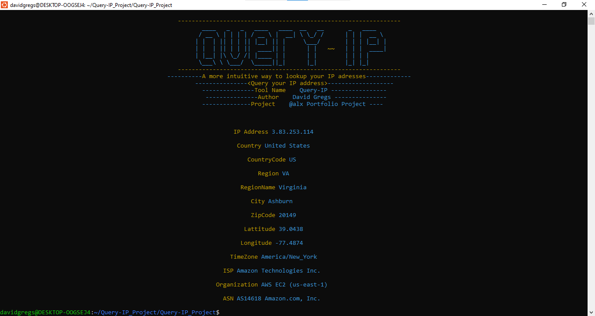

# Query-IP - A command-line tool for ip address lookup

# Brief Introduction

In order for us developers to be able to carry out our day in day out programming exercises, it is essential for us to have some simple tools close to us because this tools will facilitate the process and make our work less time consuming.

As part of my portfolio project with @alx_africa i decided to build a simple command line tool for querying IP addreses which will enable us to extract the information we need pertaining to a particular IP address like the country the person using the address is located, the city, ASN, ISP used in accessing the internet and etc. So from there we could manipulate the information we've got the way we want.

# About Query-IP

* Tool Name: Query-IP
* Author: David Gregs
* Date: 23/08/2023
* Project: @alx Portfolio project

# Getting Started

To get started;

* First, git clone this repository <https://github.com/davidgregs87/Query-IP_Project.git>  to your local computer
* Once git clone is complete, cd into /Query-IP_Project directory
* List all the content in that directory you will see a file called install.py
* Add execute permission to the file install.py i.e chmod +x install.py
* Finally, run the script by using the command ./install.py

If you did everything correctly you should see the same image as shown below;

Boom! Query-IP has been installed.

# Usage

* You can use the command "query" to see the list of options available.
* To query the IP address of your local computer you can use the command <query -m>, this will display the result of the IP address of your local computer
* To query any other IP address apart from your own(local computer), use the command "query -t <target ip>". An example is shown below;

* To uninstall Query-IP use the command <query --rm>, this will automatically uninstall the Query-IP tool.
* If there is updates, you can use the command <query -u> as shorthand or <query update> any one of these will work just fine.
* To use the help option use the command <query --help>

# Note

* This tool is only available for ubuntu, debian and termux users only
* Please always refer to this repository <https://github.com/davidgregs87/Query-IP_Project.git> to check for available updates 

This Project is still subject to code reviews and contributions from any persons, you can reach me through;

* email   <dev.dgregs7@gmail.com>
* twitter <www.twitter.com/gregs_david>
